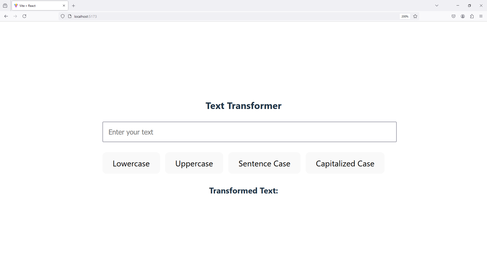

To achieve this functionality in React, you can create an input box where the user types, and then generate buttons for lowercase, uppercase, sentence case, and capitalized case. Each button will display the respective case transformation of the input text in a label.

Here's an example code to implement this:

### Code:

```jsx
import React, { useState } from 'react';

const TextTransformer = () => {
  const [inputText, setInputText] = useState('');
  const [outputText, setOutputText] = useState('');

  // Function to convert to lowercase
  const toLowerCase = () => {
    setOutputText(inputText.toLowerCase());
  };

  // Function to convert to uppercase
  const toUpperCase = () => {
    setOutputText(inputText.toUpperCase());
  };

  // Function to convert to sentence case
  const toSentenceCase = () => {
    const sentence = inputText.charAt(0).toUpperCase() + inputText.slice(1).toLowerCase();
    setOutputText(sentence);
  };

  // Function to convert to capitalized case
  const toCapitalizedCase = () => {
    const words = inputText.toLowerCase().split(' ');
    const capitalizedWords = words.map(word => word.charAt(0).toUpperCase() + word.slice(1));
    setOutputText(capitalizedWords.join(' '));
  };

  return (
    <div style={{ padding: '20px' }}>
      <h3>Text Transformer</h3>
      <input
        type="text"
        value={inputText}
        onChange={(e) => setInputText(e.target.value)}
        placeholder="Enter your text"
        style={{ padding: '10px', width: '100%', marginBottom: '20px' }}
      />

      <div>
        <button onClick={toLowerCase} style={{ marginRight: '10px' }}>Lowercase</button>
        <button onClick={toUpperCase} style={{ marginRight: '10px' }}>Uppercase</button>
        <button onClick={toSentenceCase} style={{ marginRight: '10px' }}>Sentence Case</button>
        <button onClick={toCapitalizedCase}>Capitalized Case</button>
      </div>

      <div style={{ marginTop: '20px' }}>
        <label><strong>Transformed Text:</strong> {outputText}</label>
      </div>
    </div>
  );
};

export default TextTransformer;
```

### Explanation:
1. **Input Field**: As the user types, the input text is updated using the `useState` hook.
2. **Buttons**: Four buttons for different case transformations (lowercase, uppercase, sentence case, and capitalized case).
3. **Functions**: Each button triggers a respective function that transforms the text.
4. **Label**: Displays the transformed text based on the selected button.

You can adjust the styles as needed. This component is simple, functional, and responsive for different text transformations.

`App.jsx`

```
import './App.css'
import TextTransformer from './components/TextTransformer'

function App() {  

  return (
    <>
      <TextTransformer />
    </>
  )

}

export default App
```

